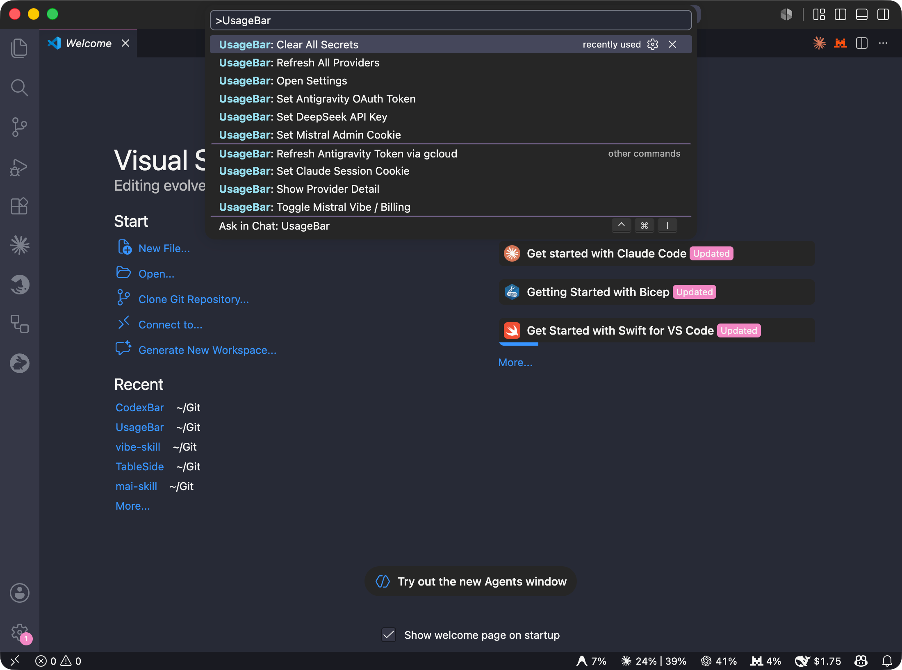
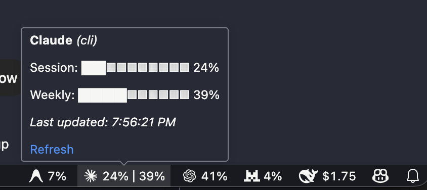

# UsageBar
[](https://marketplace.visualstudio.com/items?itemName=kimdim.usagebar)
[]

<p align="center">
  
</p>

**AI coding assistant usage in your VS Code status bar.**

UsageBar is a VS Code extension that displays real-time usage metrics — quota windows, rate limits, and account balances — for your AI coding tools, directly in the editor's status bar.



> Inspired by and based on [CodexBar](https://github.com/steipete/CodexBar) by [@steipete](https://github.com/steipete) — a macOS menu bar app with the same provider coverage. UsageBar brings the same philosophy cross-platform into VS Code.

---

## Supported Providers

| Provider | What is tracked | Auth method |
|---|---|---|
| **Claude Code** (Anthropic) | Session %, weekly %, model-specific windows | OAuth credentials or CLI (`claude /usage`) |
| **OpenAI Codex CLI** | Monthly quota % | OAuth (`~/.codex/auth.json`) or CLI |
| **Mistral** | Vibe plan quota % or monthly billing spend | Browser session cookie (auto-imported or manual) |
| **DeepSeek** | API credit balance | API key (`DEEPSEEK_API_KEY` env or VS Code secret) |
| **Antigravity** (Google Cloud Code) | Gemini + Claude/GPT quota %, reset times | Local language server, or OAuth via `antigravity-usage` |

---

## Features


- **Status bar items** — one per enabled provider; shows usage % or balance with a progress bar and custom provider icon
- **Detail popup** — click any status bar item to open a QuickPick with progress bars, reset times, and balance breakdowns; pressing Enter on any data row opens the provider's web portal
- **Configurable refresh** — manual, or automatic at 1 / 2 / 5 / 15 / 30 minute intervals
- **Native VS Code settings** — configure providers, display options, and auth sources via the standard Settings UI (`usagebar.*`)
- **Secure secret storage** — API keys and cookies stored in VS Code's built-in secret store (OS keychain-backed), never in plaintext settings
- **Cross-platform** — macOS, Linux, Windows

---

## Installation

Install from the VS Code Marketplace:

1. Open VS Code
2. Press `Ctrl+P` / `Cmd+P` → type `ext install lfmundim.usagebar`
3. Reload VS Code
4. Status bar items appear automatically; open VS Code Settings and search `usagebar` to configure

Or install the `.vsix` directly:

```bash
code --install-extension <downloaded-release>.vsix
```

---

## Quick Start

### Claude Code

UsageBar automatically reads Claude CLI credentials from `~/.claude/.credentials.json` (created by `claude login`). No manual setup required for most users.

### OpenAI Codex CLI

Reads OAuth credentials from `~/.codex/auth.json` (created by `codex login`). No manual setup needed.

### Mistral

UsageBar can import your session cookie automatically from Firefox on macOS. On other browsers or platforms, paste the full `Cookie:` header manually:

1. Open [console.mistral.ai/codestral/cli](https://console.mistral.ai/codestral/cli)
2. Open DevTools → Network tab → click any request → copy the `Cookie:` header value
3. Run **UsageBar: Set Mistral Admin Cookie** from the Command Palette

Toggle between Vibe plan % and billing spend via the detail popup (click the Mistral status bar item).

### DeepSeek

Set `DEEPSEEK_API_KEY` in your environment, or run **UsageBar: Set DeepSeek API Key** from the Command Palette. Get a key at [platform.deepseek.com/usage](https://platform.deepseek.com/usage).

### Antigravity

**Recommended setup:** install [antigravity-usage](https://www.npmjs.com/package/antigravity-usage) and run `antigravity-usage login` once. UsageBar reads its stored credentials and auto-refreshes tokens on every cycle — no manual token management needed.

```bash
npm install -g antigravity-usage
antigravity-usage login
```

If the Antigravity IDE extension language server is running (detected via `ps`), UsageBar probes it directly without needing any OAuth setup.

**Model display:** Antigravity exposes many Gemini and Claude/GPT models. UsageBar merges them intelligently:

- Models that share the same quota pool are collapsed into a single **Gemini** or **Claude|GPT** entry.
- If a model has a different remaining fraction than the rest of its group, it is shown individually (e.g. **Gemini 3.5 Flash**) with the rest shown as **Gemini (others)**.
- Claude and GPT models share a single pool and are always merged as **Claude|GPT**.

Use `usagebar.providers.antigravity.group` to choose which group appears as the primary status bar metric (`"gemini"` or `"claude"`).

---

## Configuration

All settings live under `usagebar.*` in VS Code Settings. Provider sub-settings are hidden when the provider is disabled.

| Setting | Default | Description |
|---|---|---|
| `usagebar.refreshInterval` | `"5m"` | Refresh frequency: `"manual"`, `"1m"`, `"2m"`, `"5m"`, `"15m"`, `"30m"` |
| `usagebar.display.showProviderLabel` | `true` | Show provider name alongside icon in status bar |
| `usagebar.display.progressBarStyle` | `"blocks"` | Progress bar style: `"blocks"`, `"dots"`, `"percent"` |
| `usagebar.providers.claude.enabled` | `true` | Enable Claude status bar item |
| `usagebar.providers.claude.source` | `"auto"` | Auth source: `"auto"`, `"oauth"`, `"web"`, `"cli"` |
| `usagebar.providers.claude.showExtras` | `true` | Show extra quota windows (Opus, Sonnet, Routines) in detail popup |
| `usagebar.providers.codex.enabled` | `true` | Enable Codex status bar item |
| `usagebar.providers.codex.source` | `"auto"` | Auth source: `"auto"`, `"oauth"`, `"cli"` |
| `usagebar.providers.mistral.enabled` | `true` | Enable Mistral status bar item |
| `usagebar.providers.mistral.cookieSource` | `"auto"` | Cookie source: `"auto"`, `"manual"` |
| `usagebar.providers.mistral.metric` | `"billing"` | What to show: `"billing"` (monthly spend) or `"vibe"` (quota %) |
| `usagebar.providers.mistral.showBillingInDetail` | `true` | Show billing row in detail popup |
| `usagebar.providers.deepseek.enabled` | `true` | Enable DeepSeek status bar item |
| `usagebar.providers.antigravity.enabled` | `true` | Enable Antigravity status bar item |
| `usagebar.providers.antigravity.source` | `"auto"` | Source: `"auto"`, `"cli"`, `"oauth"` |
| `usagebar.providers.antigravity.group` | `"gemini"` | Model group: `"gemini"` or `"claude"` (Claude + GPT) |

### Secret management (Command Palette)

| Command | Action |
|---|---|
| `UsageBar: Set Claude Session Cookie` | Store Claude web session cookie |
| `UsageBar: Set Mistral Admin Cookie` | Store Mistral session cookie |
| `UsageBar: Set DeepSeek API Key` | Store DeepSeek API key |
| `UsageBar: Set Antigravity OAuth Token` | Store Antigravity Google OAuth token |
| `UsageBar: Clear All Secrets` | Remove stored secrets |

---

## Architecture

```
src/
  extension.ts              # activate() / deactivate(), command registration
  providers/
    base.ts                 # ProviderInterface, UsageSnapshot types
    claude.ts               # Claude Code provider
    codex.ts                # OpenAI Codex CLI provider
    mistral.ts              # Mistral provider
    deepseek.ts             # DeepSeek provider
    antigravity.ts          # Antigravity provider
    registry.ts             # Provider registry
  statusBar/
    controller.ts           # Manages StatusBarItem instances
    renderer.ts             # Text + progress bar rendering
    detail.ts               # QuickPick detail popup
  store/
    usageStore.ts           # State holder; orchestrates refresh timer
  util/
    secrets.ts              # VS Code SecretStorage wrapper
    http.ts                 # HTTPS request helper
```

Each provider implements `ProviderInterface`:

```typescript
interface ProviderInterface {
  readonly id: string;
  isAvailable(): Promise<boolean>;
  fetch(): Promise<UsageSnapshot>;
}
```

---

## Contributing

Pull requests welcome. Please open an issue first for large changes.

```bash
git clone https://github.com/lfmundim/UsageBar
cd UsageBar
npm install
npm run compile
# Press F5 in VS Code to launch Extension Development Host
```

---

## Credits

- [CodexBar](https://github.com/steipete/CodexBar) by [@steipete](https://github.com/steipete) — the macOS menu bar app that inspired this project. Provider integration logic, API endpoints, auth strategies, and data parsing approaches in UsageBar are directly derived from studying CodexBar's open-source implementation.
- [antigravity-usage](https://github.com/skainguyen1412/antigravity-usage) by [@skainguyen1412](https://github.com/skainguyen1412) — CLI tool that handles Google Cloud Code OAuth for Antigravity. UsageBar reads its stored credentials and delegates token refresh to it.

---

## License

MIT — see [LICENSE](LICENSE).
